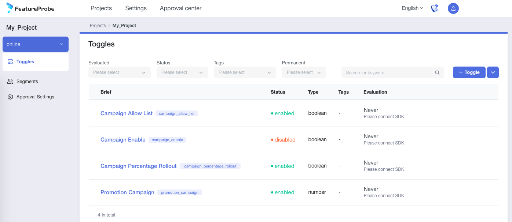

# FeatureProbe

FeatureProbe 是一个开源的 **『功能』管理** 服务。它包含灰度放量、AB实验、实时配置变更等针对『功能粒度』的一系列管理操作。这里的『功能』包含业务功能、技术改造、运营活动等任何涉及代码开发的『功能』。它可以让开发人员、运营人员、运维人员安全、高效的完成线上变更，同时精细控制变更风险。『功能』粒度的发布管理是实现DevOps的核心工具之一，通过『功能』开关，可以降低分支开发带来的合并复杂性，轻松实现主干开发以及持续交付。

『功能』粒度开关管理服务已经是各个互联网大厂的标配平台，我们将互联网大厂内部『功能』开关管理平台的优秀实践与经验融入这个开源项目中。希望推广『功能』管理理念和实践在软件开发社区的普及，携手开源社区，提升软件开发行业的效能。

请访问我们的[文档服务](https://docs.featureprobe.io/zh-CN/)获取更多信息。

### FeatureProbe适用于哪些场景

根据我们的经验，FeatureProbe可以在以下场景中提升软件研发的效能:

1. **『功能粒度』灰度发布**:
每个功能独立灰度发布给用户。可迅速关闭受BUG影响的功能，同时不影响其他正常功能的使用。
3. **降低测试环境搭建成本**:
节约测试环境搭建和线下测试时间成本。利用线上环境小流量测试，环境真实同时影响可控。
2. **降低故障恢复时间**:故障发生时通过降级策略调整服务行为，保障用户主路径不受影响。
3. **简化研发协同方式**: 
用功能开关替代传统分支开发的团队协同模式。真正实现主干开发、持续部署。减少分支合并冲突，显著加快迭代速度。
4. **统一的配置管理中心**:
通过用户友好的操作页面，统一操作线上配置，实时修改功能参数，让运营活动生效更简单。
6. **更多的使用场景!** 
期待大家与我们一起去发现与尝试。

 

## Getting Started

FeatureProbe 由以下各子模块组成：

1. [API Server](https://gitee.com/featureprobe/feature-probe-api/blob/main/README.md)：提供核心数据管理和对外API。
2. [Evaluation Server](https://gitee.com/FeatureProbe/feature-probe-ui/blob/main/README.md)：提供高性能的灰度规则判定引擎。
3. [UI/Portal](https://gitee.com/FeatureProbe/feature-probe-ui/blob/main/README.md)：提供用户操作页面
4. database
5. 各种语言SDK.
 

对于想要体验一下FeatureProbe的新用户，我们提供了一个[online](https://featureprobe.io/demo/)的演示环境，也可以通过我们提供的Docker compose一键启动所有核心服务（包含API Server，Evaluation Server，UI，database），镜像拉取可能需要一点时间，我们也提供了国内镜像下载的[加速方案](DOCKER_HUB.md) 。所有四个服务也有单独的Docker镜像用于单独部署，或者对于高手来说也可以直接从源码编译运行。

### 启动FeatureProbe

1. 你可以使用在线环境[FeatureProbe Demo](https://featureprobe.io/demo/)，我们提供一个FeatureProbe的UI环境，以及一个模拟的受FeatureProbe控制的网站应用。你可以在线体验通过FeatureProbe控制网站应用的展示。见[教程](https://docs.featureprobe.io/zh-CN/tutorials/try_demo)

2. 也可以使用docker composer来设置自己的FeatureProbe服务：详见[教程](http://localhost:3000/zh-CN/tutorials/setup_own_env)

### 在你自己服务代码中调用FeatureProbe SDK

FeatureProbe 提供两种类型的SDK：

第一种是服务端SDK(例如：
[Java SDK](https://gitee.com/FeatureProbe/server-sdk-java/blob/main/README.md), 
[Rust SDK](https://gitee.com/FeatureProbe/server-sdk-rust/blob/main/README.md)
) ，这类SDK一般适用于后端服务，SDK从FeatureProbe平台获取开关配置信息，在内存中执行规则进而控制宿主程序的行为，可用做控制灰度的用户属性可以按需添加。

另一种是客户端SDK（例如： [Javascript SDK](https://gitee.com/FeatureProbe/client-sdk-js/blob/main/README.md), 
或者 iOS，Android使用的  [mobile SDK](https://gitee.com/FeatureProbe/client-sdk-mobile/blob/main/README.md) ），客户端会连接Evaluation Server获取属于当前用户的开关配置。

以下是我们已经支持语言的SDK：

**服务端SDK**

* [Java SDK](https://gitee.com/FeatureProbe/server-sdk-java)
* [Rust SDK](https://gitee.com/FeatureProbe/server-sdk-rust)
* [Golang SDK](https://gitee.com/FeatureProbe/server-sdk-go)
* [Python SDK](https://gitee.com/FeatureProbe/server-sdk-python) by [@HeZean](https://github.com/HeZean)
* [Node.js SDK](coming soon...)

**客户端SDK**

* [Javascript SDK](https://gitee.com/FeatureProbe/client-sdk-js)
* [Android SDK](https://gitee.com/FeatureProbe/client-sdk-mobile)
* [iOS SDK](https://gitee.com/FeatureProbe/client-sdk-mobile)

各语言SDK都提供example目录和代码，可以直接运行example代码来体验FeatureProbe平台与SDK的交互。

### API 文档

所有通过FeatureProbe UI操作的功能，都可以通过OpenAPI直接编程访问，Open API的文档可以参考这里：

* 通过online的Demo环境，访问[https://featureprobe.io/api-docs](https://featureprobe.io/api-docs)
* 通过Docker访问：在API服务启动的情况下，打开：`http://localhost:4009/api-docs` 就可以查看所有API的接口和使用方法。

## Contributing

我们仍在不断迭代，为FeatureProbe补充更多的功能，以便适应更多的使用场景和用户需求。开发活动会基于github的代码库持续发布。欢迎开源社区的朋友加入我们，提需求、报bug、参与社区讨论、提交PR都可以。

Please read [CONTRIBUTING](CONTRIBUTING.md) for details on our code of conduct, and the process for 
taking part in improving FeatureProbe.

## License

This project is licensed under the Apache 2.0 License - see the [LICENSE](LICENSE) file for details.

## Community and Sharing

我们搭建了一个微信社区，帮助新朋友尽快了解FeatureProbe，新老朋友们也可以在社区一起讨论关于『功能』管理相关的任何话题. 扫描以下二维码加入我们。

如果想上报BUG，或者贡献代码，请使用Github的Issue和PR功能： [GitHub issue](https://github.com/FeatureProbe/FeatureProbe/issues/new/choose) 

## Star History

